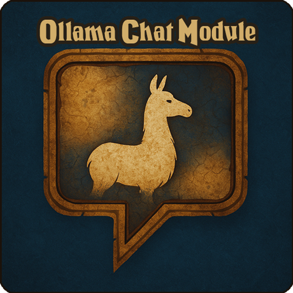

<p align="center">
  
</p>

<h1 align="center">SynthiqBots</h1>

<p align="center"><b>Your party has something to say.</b><br>
Playerbots that talk in character, understand what you ask, and actually do it.</p>

<p align="center">
  
  
  
</p>

---

Playing on your own private server shouldn't mean adventuring alone. With
[mod-playerbots](https://github.com/mod-playerbots/mod-playerbots) you already have a world full of
bots — but they don't *listen*. SynthiqBots gives them a brain: you whisper a bot like you'd whisper
a friend, it answers in character, checks its own bags and quest log before it speaks, and then does
what you asked. Invite one into your group and it becomes a real companion until you kick it.

Built for **AzerothCore (WotLK 3.3.5a) + mod-playerbots**, for solo players and small groups who miss
the feeling of a party that talks back.

## What it does for you

<sub>Sample exchanges below are illustrative — real replies depend on your model and the game state.</sub>

**Talk to any bot you meet.**
Whisper a random playerbot, or say its name in party, raid, say or General — it wakes up with the
smart brain for ten minutes and answers as itself, from real game data.

> **You:** Brick, what are you wearing and have you got any linen?<br>
> **Brick:** Mostly mail, the Defias leggings are my pride. Six Linen Cloth in my bags — want them?

**Recruit it on the road.** Invite that bot to your group and it becomes a full companion: it follows
you, obeys follow / stay / attack, joins the tactical loop and takes orders from your party leader.
Kick it and it goes back to being an ordinary playerbot until you speak to it again.

**A leader who runs the party for you.** One designated bot leads your squad. Tell it what you want in
plain words and it relays the orders to everyone — follow, stay, attack, raid markers, ready checks,
converting to a raid.

> **You (party):** everyone follow me and mark the boar skull

**Real hands in the world, not just words.** Behind the chat sits an in-game tool server with more
than 200 actions — inventory and gear, loot rules, quests, trading, vendors and repairs, groups and
guilds, the auction house, travel. When a bot says it did something, it called the game to do it.

> **You:** Sell your grey junk and repair before we head out.

**A leader who suggests what's next.** A while after you log in, the leader may propose something to
do — a quest in your log, one nearby, or a dungeon that fits your level — and waits for your answer.
Say no and it drops it.

> **Leader:** How about we knock out *Fate of Yenniku* before dark?<br>
> **You:** yes

**Short orders snap, conversations think.** "follow me", "attack", "stay" take a fast path and land in
about a second; longer questions go to the full agent with tools.

**Company between fights.** Nearby companions react to what just happened with short remarks or
emotes, with limits on chatter so it never floods your screen. Combat itself stays with playerbots,
which already fights well.

**Command by voice.** Hold a push-to-talk key in the desktop app (macOS / Windows), speak, and the
leader acts and replies — no alt-tabbing to type.

**A client addon for the buttons you use most.** The **SynthiqBots UI** addon puts playerbot
commands on a toolbar in your WoW client.

## How it fits together

```
 your chat / voice
        │
        ├── short command ──► fast lane (Ollama or any OpenAI-compatible model)
        │                         classifier · tactical loop · proactive checks
        │
        └── conversation ───► smart lane (an agent gateway you run)
                                  │
                                  ▼
                     in-game MCP tool server (200+ actions)
                                  │
                                  ▼
                     mod-playerbots: movement, combat, looting
```

- **Fast lane** — cheap, frequent calls: routing short commands, the per-bot tactical tick, deciding
  whether the leader should speak up. Local [Ollama](https://ollama.com) or any OpenAI-compatible
  endpoint (e.g. DeepSeek). An optional [TypeSafe](https://typesafe.ai) decision tier can answer the
  simple yes/no calls even faster.
- **Smart lane** — an OpenAI-compatible agent gateway (OpenClaw / Synthiq-style) that holds the
  conversation and drives the game through the embedded MCP server.
- **Playerbots** keeps doing what it does best: fighting, following, looting.

## What you need

- An AzerothCore **mod-playerbots** fork server
  ([mod-playerbots/azerothcore-wotlk](https://github.com/mod-playerbots/azerothcore-wotlk)) with
  [mod-playerbots](https://github.com/mod-playerbots/mod-playerbots) and a WotLK 3.3.5a client.
- A fast-lane model: local Ollama, or an API key for an OpenAI-compatible provider.
- For conversations with tools: an agent gateway that speaks the OpenAI chat API and can call MCP
  tools. Without one you still get the fast lane, but the talking companions need the gateway.

This is a server module. It needs a rebuild of your worldserver and some configuration — there is no
one-click install.

## Quick start

1. Clone into your AzerothCore source tree (the folder name matters):
   ```bash
   cd azerothcore-wotlk/modules
   git clone https://github.com/synthiq-ai/synthiqbots.git mod-ollama-chat
   ```
2. Rebuild the worldserver as usual. Dependencies and the Docker build:
   [docs/agent-context/BUILD.md](docs/agent-context/BUILD.md).
3. Copy `conf/mod_ollama_chat.conf.dist` to your server's `etc/modules/mod_ollama_chat.conf`.
4. Quiet playerbots' own chatter in `playerbots.conf` so the two don't talk over each other:
   `AiPlayerbot.EnableBroadcasts`, `RandomBotTalk`, `RandomBotEmote`, `RandomBotSuggestDungeons`,
   `EnableGreet`, `GuildFeedback`, `RandomBotSayWithoutMaster` = `0`.
5. Point the fast lane at your model: `OllamaChat.Tactical.Url` and
   `OllamaChat.Gateway.OllamaClassifier.Url` — an Ollama `/api/generate` URL, or an OpenAI-compatible
   `/chat/completions` URL plus `OllamaChat.OpenAiCompat.ApiKey`.
6. Turn on the smart lane: `OllamaChat.Gateway.Enable`, the bots that get it
   (`Gateway.BotGUIDs` + a `gateway_overrides.json` with your gateway URL and token), your account in
   `Gateway.WhitelistAccountIds`, and `OllamaChat.Mcp.*` so your gateway can reach the tool server.
7. Start the server (or `.ollama reload` in game) and check `.ollama gateway status`. Whisper your bot.

The full walkthrough, including party/fleet setup, lives in [docs/gateway.md](docs/gateway.md) and
[docs/autonomous-bots.md](docs/autonomous-bots.md).

## Go further

| You want | Read |
|---|---|
| Talking companions, gateway setup, per-bot routing | [docs/gateway.md](docs/gateway.md) |
| Any bot you whisper or invite gets the brain | [docs/bot-promotion.md](docs/bot-promotion.md) |
| A leader bot running a party of bots | [docs/autonomous-bots.md](docs/autonomous-bots.md) |
| The per-bot tactical loop | [docs/tactical.md](docs/tactical.md) |
| The leader proposing quests and dungeons | [docs/proactive-leader.md](docs/proactive-leader.md) |
| Voice commands and the desktop app | [docs/voice-command.md](docs/voice-command.md), [docs/voice-command-app.md](docs/voice-command-app.md) |
| The SynthiqBots UI client addon | [docs/synthiqbots-ui.md](docs/synthiqbots-ui.md) |
| The TypeSafe decision tier | [docs/jev.md](docs/jev.md) |
| Server-admin MCP (logs, DB, containers) | [docs/ops-api.md](docs/ops-api.md), [docs/admin-mcp.md](docs/admin-mcp.md) |
| Architecture and source layout | [docs/agent-context/ARCHITECTURE.md](docs/agent-context/ARCHITECTURE.md) |
| Every setting | [`conf/mod_ollama_chat.conf.dist`](conf/mod_ollama_chat.conf.dist) |

## Honest limits

- **Not every bot on the realm talks.** Only the bots you configure, bots you whisper or name (up to a
  small cap, for ten minutes), bots in your group, and a few nearby companions for ambient remarks.
- **LLMs make mistakes.** Bots check real game state through tools, but a model can still misread a
  request or say something odd. Pick a capable model for the smart lane.
- **It is not free by default.** Local Ollama costs nothing but hardware; hosted models and agent
  gateways bill per call. The fast lane runs often, so choose it with that in mind.
- **Combat is playerbots.** SynthiqBots decides *what* to do and talks about it; it doesn't replace
  playerbots' fighting AI.
- **Dungeon suggestions are suggestions.** The leader proposes and follows you; it doesn't walk you to
  the entrance or clear it for you.

## Credits and license

SynthiqBots is the public mirror of the Synthiq fork of
[mod-ollama-chat](https://github.com/DustinHendrickson/mod-ollama-chat) by **Dustin Hendrickson**,
which brought LLM chat to playerbots in the first place. It builds on
[AzerothCore](https://www.azerothcore.org) and [mod-playerbots](https://github.com/mod-playerbots/mod-playerbots).

Released under the **GNU Affero General Public License v3.0** — see [LICENSE](LICENSE).
